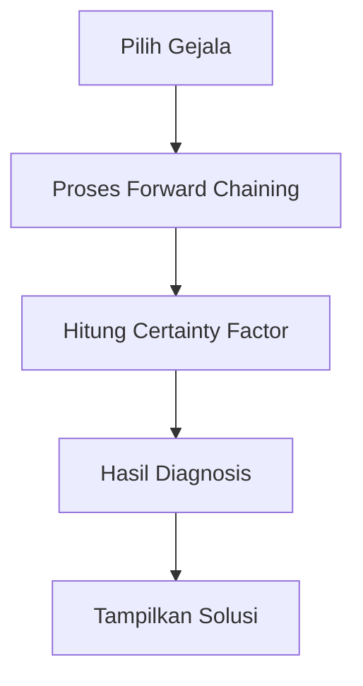

# Sistem Pakar Diagnosis Kerusakan Rambut


Sistem pakar berbasis web untuk mendiagnosis kerusakan rambut menggunakan metode **Forward Chaining** dan **Certainty Factor**. Dikembangkan sebagai Tugas UAS Mata Kuliah Sistem Pakar.

## 🎯 Fitur Utama
- **Diagnosis Cerdas**: Analisis gejala kerusakan rambut dengan metode Forward Chaining
- **Certainty Factor**: Penghitungan tingkat keyakinan diagnosis
- **Basis Pengetahuan Lengkap**: 26 gejala dan 8 jenis kerusakan rambut
- **Antarmuka Interaktif**: Form input gejala yang user-friendly
- **Hasil Detail**: Diagnosis lengkap dengan tingkat keyakinan dan solusi
- **Manajemen Data**: CRUD untuk gejala, aturan, dan jenis kerusakan

## 🧠 Metodologi
### 1. Forward Chaining
- Proses inferensi dari gejala menuju diagnosis
- Pencocokan aturan berbasis IF-THEN
- Perhitungan persentase diagnosis:
  ```
  P(A) = (Jumlah gejala cocok / Total gejala aturan) × 100%
  ```

### 2. Certainty Factor
- Pengukuran tingkat keyakinan diagnosis
- Kombinasi CF untuk multiple gejala:
  ```
  CFcombine = CF1 + CF2 × (1 - |CF1|)
  ```
- Dimana CF = MB (Measure of Belief) - MD (Measure of Disbelief)

## 🛠️ Teknologi Stack
| Komponen | Teknologi |
|----------|-----------|
| **Backend** | PHP 7.4+, CodeIgniter 3 |
| **Database** | MySQL 8.0 |
| **Frontend** | HTML5, CSS3, JavaScript, Bootstrap 4 |
| **Algoritma** | Forward Chaining, Certainty Factor |
| **Tools** | Visual Studio Code, XAMPP |

## 📂 Struktur Proyek
```
├── application/
│   ├── controllers/     # Logika aplikasi
│   ├── models/          # Model database & aturan
│   ├── views/           # Tampilan UI
│   └── libraries/       # Library Forward Chaining & CF
├── assets/              # CSS, JS, gambar
├── system/              # Core CodeIgniter
├── uploads/             # Dokumentasi
└── database.sql         # Skema database
```

## 📋 Basis Pengetahuan
### Jenis Kerusakan Rambut
| Kode | Nama | Gejala Utama |
|------|------|--------------|
| D1 | Rambut Kering | G1, G2, G3, G4, G6, G7 |
| D2 | Rambut Rusak | G1, G4, G8, G9, G10 |
| D3 | Rambut Bercabang | G11, G12, G13 |
| D4 | Rambut Rontok | G14, G15, G16 |
| D5 | Rambut Berminyak | G17, G18, G19 |
| D6 | Ketombe | G20, G21, G22 |
| D7 | Kebotakan Parsial | G14, G23, G24 |
| D8 | Rambut Mengembang | G1, G5, G25, G26 |

### Contoh Aturan
```php
$rules = [
    [
        'if' => ['G11', 'G12', 'G13'], // Ujung bercabang, kasar, tidak tumbuh
        'then' => 'D3' // Rambut Bercabang
    ],
    [
        'if' => ['G14', 'G15', 'G16'], // Rontok >100 helai, menipis, kulit terlihat
        'then' => 'D4' // Rambut Rontok
    ]
];
```

## 🚀 Instalasi
1. **Clone repositori**
   ```bash
   git clone https://github.com/luqmanaru/Sistem-Pakar-Rambut.git
   ```

2. **Konfigurasi database**
   - Impor file `database.sql` ke MySQL
   - Edit `application/config/database.php`:
     ```php
     $db['default'] = array(
         'hostname' => 'localhost',
         'username' => 'root',
         'password' => '',
         'database' => 'db_sistem_pakar_rambut',
         'dbdriver' => 'mysqli'
     );
     ```

3. **Jalankan aplikasi**
   - Gunakan XAMPP/WAMP
   - Akses melalui `http://localhost/Sistem-Pakar-Rambut`

## 💡 Cara Penggunaan
1. Buka halaman utama sistem
2. Pilih gejala yang dialami dari 26 gejala tersedia
3. Klik tombol "Diagnosis"
4. Sistem akan menampilkan:
   - Hasil diagnosis kerusakan rambut
   - Tingkat keyakinan (Certainty Factor)
   - Solusi dan rekomendasi perawatan

## 📊 Contoh Studi Kasus
### Kasus: Hanif Luqmanul Hakim
**Gejala**: Rambut rontok >100 helai/hari (G14), Rambut menipis (G15), Rambut mengembang (G5)

**Perhitungan Forward Chaining**:
- D4 (Rambut Rontok): 2/3 gejala cocok = 66.7%
- D8 (Rambut Mengembang): 1/4 gejala cocok = 25%

**Perhitungan Certainty Factor**:
- CF(G14) = 0.9
- CF(G15) = 0.7
- CFcombine = 0.9 + 0.7 × (1 - |0.9|) = 0.97

**Hasil**: Rambut Rontok (D4) dengan CF 0.97

## 📸 Tampilan Aplikasi
### Halaman Dashboard


### Form Input Gejala


### Hasil Diagnosis


## 👨‍💻 Tim Pengembang
Proyek ini dikembangkan oleh **Kelompok 4** sebagai Tugas UAS Sistem Pakar:

| Nama | NIM | Peran |
|------|-----|------|
| Davidra Deva | 2022310041 | Analisis Sistem, UI/UX |
| Danur Faqih | 2022310081 | Basis Pengetahuan, Aturan |
| Hanif Luqmanul Hakim | 2022310035 | Algoritma, Implementasi |
| Imam Fajar Hudaya | 2022310087 | Pengujian, Dokumentasi |
| Muhammad Nur Ilyas | 2022310075 | Database, Integrasi |

## 🔧 Alur Sistem


---
**luqmanaru**

Proyek ini dikembangkan sebagai Tugas UAS Mata Kuliah Sistem Pakar. Sistem dirancang untuk membantu masyarakat mendeteksi kerusakan rambut secara mandiri sebelum berkonsultasi dengan ahli.
